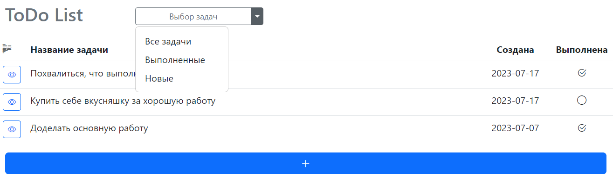
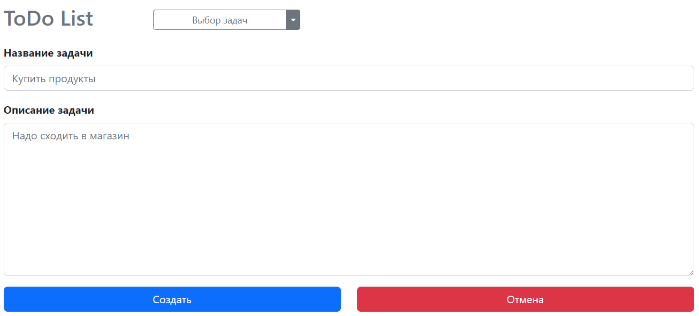
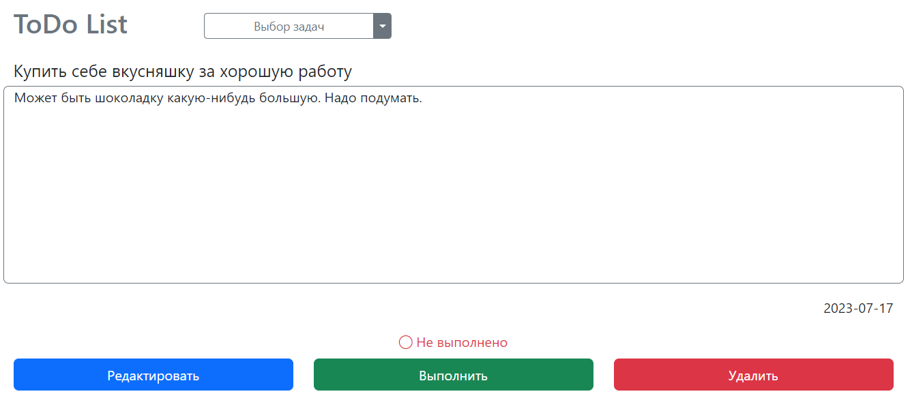
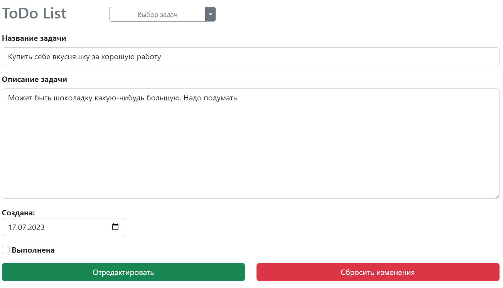

## job4j_todo

В данном проекте разработан простейший **todo-list**.<br>
Из доступного на данный момент функционала есть добавление задач, просмотр, редактирование и удаление, а 
также можно отметить задачу выполненной. Ничего особенного, в принципе. В скором времени собираюсь 
добавить регистрацию пользователей, категории задач, немного доработать функционал. 

База данных пока реализована одной таблицей:
* **tasks** - все задачи;

В качестве основного фреймворка используется **Spring Framework**.<br>
Страницы разработаны с помощью **Thymeleaf** и **Bootstrap**, а также использованы зависимости:
**PostgreSQL 42.5.4**, **Liquibase 4.15.0** и **Hibernate 5.6.15.**

#### Требования к окружению: 
* Java 17.0.2, 
* PostgreSQL 14.0, 
* Apache Maven 3.8.4

#### Используемые технологии:
* Java 17
* Maven 3.8
* PostgreSQL 14
* Spring Boot
* Hibernate 5
* Liquibase 4
* Thymeleaf
* Bootstrap
* Checkstyle
* Log4J
* IntelliJ IDEA 2022.1.2

#### Запуск проекта:
```
1. Для запуска проекта, Вам необходимо клонировать проект из этого репозитория;
2. Затем необходимо создать локальную базу данных "todo";
3. После - пропишите, пожалуйста, логин и пароль к созданной вами базе данных в файл db/liquibase.properties;
4. Далее запустите liquibase для предварительного создания таблиц;
5. Запустите приложение одним из представленных ниже способов:
  5.1 Через класс Main, находящийся в папке src\main\java\ru\job4j\cinema;
  5.2 Скомпилировав и запустив проект через maven командой mvn spring-boot:run;
  5.3 Собрав проект через maven и запустив собранный файл командой java -jar job4j_todo-1.0-SNAPSHOT.jar;
6. Открыть в браузере страницу http://localhost:8080/index;
7. Вы великолепны!
```
##### Доступные страницы:
**Главная страница, встречающая пользователя, а по-совместительству список всех задач:**

**Форма для создания новой задачи, которой присваивается сегодняшняя дата и статус "не выполнена":**

**Страница с подробным описанием задачи:**

**Форма для редактирования задачи:**

На данный момент это весь простой функционал, но проект будет немного доработан.

#### Искренне благодарю за внимание к моему проекту!

### Контакты для связи:
> <a href="https://github.com/Niaktes/">Захаренко Сергей</a> <br>
> Телефон: +7 995 299 07 34 <br>
<a href="https://t.me/SZakharenko"></a>
<a href="https://wa.me/89265900734"></a>
<a href="mailto:Sergei.Zakharenko.it@gmail.com"></a>
